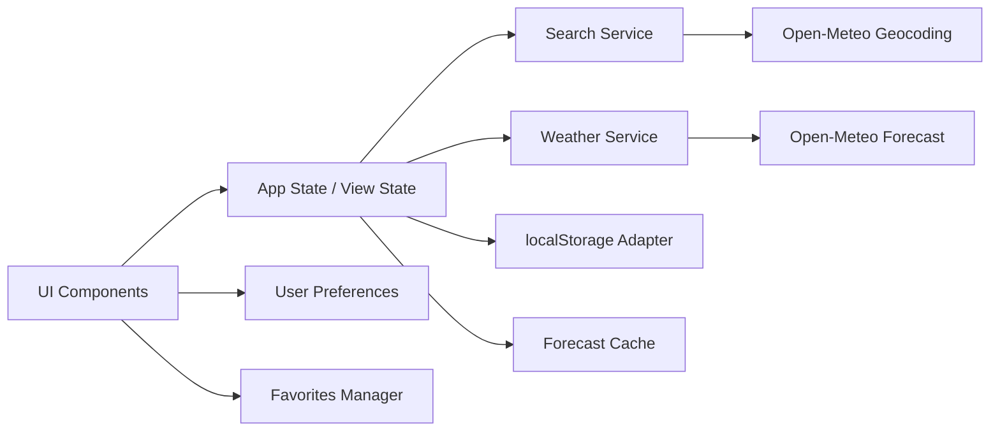

# Weather App — Plano Técnico

## Architecture Overview

O projeto será uma aplicação web em React + TypeScript com arquitetura orientada a componentes e serviços dedicados. A camada de apresentação será responsável apenas por renderização, eventos de interação e consumo de estado; a lógica de integração com Open-Meteo ficará isolada em serviços; e o estado da aplicação ficará centralizado em um modelo simples de máquina de estados para garantir consistência entre busca, clima, erro e favoritos.

Diagrama conceitual:



### Camadas principais
- Apresentação (`components`): busca, sugestões, favoritos, previsão, unidades,
  loading, erro e regiões acessíveis; recebe dados e callbacks por props.
- Orquestração (`hooks`): estado da aplicação, debounce, geolocalização,
  persistência e ciclo de forecast; coordena efeitos sem decidir a aparência.
- Acesso a dados (`services`): chamadas HTTP para geocoding e forecast,
  integração com `navigator.geolocation`, `localStorage`, timeout, retry e
  validação dos payloads externos.
- Domínio funcional (`lib`): funções puras para normalização, conversão de
  unidades, formatação de datas, mapeamento de códigos WMO, cache e seletores.
- Contratos (`types`): tipos compartilhados entre componentes, hooks, serviços
  e funções de domínio; não contém efeitos colaterais.
- Composição (`App.tsx`): monta a tela, inicializa o hook principal e conecta
  estado, ações e componentes; não implementa fetch nem regras de conversão.

Regras de dependência:

```text
components -> hooks -> services
components -> hooks -> lib
components/hooks/services/lib -> types
services -> lib (somente funções de validação/normalização necessárias)
```

`lib` não conhece React, navegador ou Open-Meteo. `services` não conhece a
árvore de componentes. Assim, as regras puras podem ser testadas isoladamente
e a UI permanece desacoplada do formato da API.

### Decisão de arquitetura
- Usar React com composição de componentes e hooks reutilizáveis
- Isolar o modelo de domínio para evitar acoplamento entre API externa e rendering
- Tratar erro, loading e vazio como estados explícitos e observáveis para a UI
- Priorizar previsibilidade sobre abstrações complexas; o MVP exige robustez de concorrência e cache, mas sem over-engineering

---

## Tech Stack

- React + Vite para aplicação SPA
- TypeScript em modo estrito para contrato estável e validação de dados
- Tailwind CSS para visual dark glassmorphism e responsividade
- Vitest + Testing Library para testes unitários e de integração
- Playwright para E2E, incluindo acessibilidade e fluxos críticos
- Open-Meteo Geocoding API e Forecast API sem API key
- localStorage como persistência client-side
- Biome para lint e formatação

### Justificativa
- O ecossistema escolhido atende a especificação do projeto e reduz dependências externas
- O uso de Open-Meteo é compatível com o requisito de sem backend próprio
- Vitest e Playwright cobrem de forma eficiente unitários, integração e E2E
- Tailwind acelera a implementação de interface responsiva e visual consistente

---

## Project Structure

```text
src/
  components/
    SearchBar.tsx
    SearchSuggestions.tsx
    WeatherCard.tsx
    ForecastList.tsx
    FavoritesList.tsx
    UnitToggle.tsx
    LocationHeader.tsx
    ErrorState.tsx
    LoadingState.tsx
  hooks/
    useWeather.ts
    useDebouncedSearch.ts
    useGeolocation.ts
    useLocalStorage.ts
  services/
    geocoding.ts
    forecast.ts
    geolocation.ts
    storage.ts
    validation.ts
  types/
    weather.ts
    location.ts
    preferences.ts
    favorites.ts
  lib/
    date.ts
    units.ts
    normalize.ts
    weather-code.ts
    cache.ts
  App.tsx
  main.tsx
  index.css

tests/
  unit/
  integration/
  e2e/

specs/
  weather-app-spec.md

plans/
  weather-app-plan.md

tasks/
  weather-app-tasks.md
```

### Responsabilidades por pasta
- components: apresentação pura, acessível e responsiva; sem chamadas de API
  ou transformação de unidades.
- hooks: estado e orquestração de ações; `useWeather` expõe o estado observável
  e comandos para busca, seleção, atualização e favoritos.
- services: fronteiras com Open-Meteo, geolocalização e armazenamento local;
  convertem respostas externas para os contratos internos.
- lib: funções puras e determinísticas de normalização, conversão, formatação,
  mapeamento de condições e regras de cache.
- types: contratos do domínio e tipos de estado usados por todas as camadas.
- `App.tsx`: composição da aplicação e passagem explícita de props.

---

## Data Model

### Localidade
```ts
interface Location {
  id: string;
  name: string;
  latitude: number;
  longitude: number;
  country?: string;
  countryCode?: string;
  admin1?: string;
  timezone: string;
}
```

### Localidade de geolocalização
```ts
interface GeolocationLocation extends Location {
  id: `geolocation:${string}`;
  name: 'Localização atual';
}
```

### Forecast canônico
```ts
interface WeatherForecast {
  location: Location;
  current: {
    time: string;
    temperature: number;
    relativeHumidity: number | null;
    apparentTemperature: number | null;
    windSpeed: number | null;
    weatherCode: number | null;
  };
  daily: Array<{
    date: string;
    weatherCode: number | null;
    temperatureMax: number | null;
    temperatureMin: number | null;
    precipitationProbability: number | null;
  }>;
  timezone: string;
  storedAt: number;
}
```

### Preferências
```ts
interface Preferences {
  temperatureUnit: 'C' | 'F';
  speedUnit: 'km/h' | 'mph';
}
```

### Favoritos
```ts
interface FavoriteItem {
  location: Location;
}
```

### Estado observável
O estado meteorológico exposto à árvore de componentes usa uma máquina de
estados pequena e explícita:

```ts
type WeatherStatus = 'idle' | 'loading' | 'success' | 'error' | 'empty';

interface WeatherState {
  status: WeatherStatus;
  data: WeatherForecast | null;
  error: WeatherError | null;
  isRefreshing: boolean;
}
```

`empty` representa uma resposta válida sem previsão utilizável. `error`
representa falha sem dados para exibir. Quando uma atualização falha depois de
um forecast válido, `data` é preservado, `status` permanece `success` e
`isRefreshing` volta a `false`; a UI apresenta o erro como aviso de dados
anteriores. Busca, sugestões e geolocalização possuem estados operacionais
próprios no hook, sem ampliar o contrato do painel meteorológico.

### Regras de domínio
- `id` é a identidade primária para deduplicação de favoritos
- `storedAt` deve ser gerado em `Date.now()` e usado para expiração do cache
- `timezone` é obrigatório e usado para a apresentação de datas e horários
- Dados são armazenados em unidades canônicas e convertidos apenas na UI

---

## Data Flow

### 1. Busca por localidade
- O usuário digita no campo de busca
- A entrada é normalizada: trim + compressão de espaços internos
- O hook de debounce dispara após 300 ms
- A requisição de geocoding é iniciada somente quando a consulta tem pelo menos 2 letras Unicode
- O serviço aborta a operação anterior sempre que possível
- A resposta mais recente prevalece; respostas antigas são ignoradas

### 2. Seleção da localidade
- A localidade escolhida passa a ser a seleção atual
- O estado meteorológico muda para `loading`
- A chamada de forecast é iniciada com latitude, longitude e timezone da cidade
- O cache local é consultado antes de acelerar a renderização ou emitir erro

### 3. Resposta do forecast
- O serviço valida a estrutura da resposta, timezone, unidades e campos obrigatórios
- Se a resposta for válida, ela é convertida para o modelo de domínio
- Se houver falhas parciais, os campos inválidos são marcados como indisponíveis
- O resultado é salvo em cache local e renderizado no estado correspondente

### 4. Geolocalização automática
- Ao abrir a aplicação, inicia uma tentativa única com timeout de 10s
- Em sucesso, cria uma Localidade sintética com `id` calculado a partir de coordenadas arredondadas em 4 casas decimais
- Em falha, a aplicação retorna ao estado inicial e mantém o fluxo manual disponível
- A geolocalização não sobrescreve seleção do usuário quando ela chega depois

### 5. Favoritos e persistência
- O usuário salva a localidade atual como favorito
- O item é persistido em `localStorage` usando a chave correta
- Em abertura, favoritos e preferências são restaurados e validados
- O cache de forecast é consultado por `location.id` e revalidado quando necessário

---

## External APIs

### Geocoding API
- Endpoint: `GET https://geocoding-api.open-meteo.com/v1/search`
- Parâmetros relevantes: `name`, `count=10`, `language=pt`
- Critérios de aceite: aceita busca por cidade, region, acentos e espaços; ordena resultados by provider output; suporta até 10 sugestões
- Validação: rejeitar entradas vazias, consultas com menos de 2 letras Unicode e estruturas inválidas

### Forecast API
- Endpoint: `GET https://api.open-meteo.com/v1/forecast`
- Parâmetros relevantes: latitude, longitude, `timezone=auto`, `forecast_days=7`, `current`, `daily`
- Regras de negócio: uso de unidades canônicas em Celsius e km/h; conversão somente em UI
- Validação: campos estruturais obrigatórios, timezone consistente com a localidade e unidades compatíveis

### Geolocation API
- Interface do navegador: `navigator.geolocation`
- Regras: tentativa única no init, timeout de 10s, feedback não bloqueante e prioridade do usuário sobre a operação automática

### Limitations e invariantes
- Não há backend próprio nem servidor de dados
- Toda resposta externa deve ser validada antes de compor o modelo de domínio
- Todas as chamadas devem ser protegidas por timeout, retry controlado e concorrência explícita

---

## State Management

A abordagem será um estado local centralizado no hook `useWeather`, montado no
topo da árvore por `App`. Não será usada uma biblioteca adicional como Redux.
Componentes filhos são apresentacionais: recebem estado derivado e callbacks
por props e não acessam serviços, cache ou `localStorage` diretamente.

- `useWeather` possui a localidade selecionada, forecast canônico, status,
  erro, preferências, favoritos e comandos de busca/seleção/atualização
- `useWeatherQuery` encapsula o ciclo de request, retry, timeout e atualização de cache
- `useDebouncedSearch` centraliza a busca com debounce e cancelamento
- `useLocalStorage` abstrai persistência com degradação graciosa
- `useGeolocation` encapsula a tentativa automática e priorização de ação do usuário

### Estrutura de estado
```ts
interface UseWeatherState {
  weather: WeatherState;
  selectedLocation: Location | null;
  searchQuery: string;
  suggestions: Location[];
  searchStatus: 'idle' | 'loading' | 'success' | 'error' | 'empty';
  lastSearchError: SearchError | null;
  favorites: Location[];
  preferences: Preferences;
}

interface UseWeatherActions {
  search(query: string): void;
  selectLocation(location: Location): void;
  refresh(): void;
  setTemperatureUnit(unit: 'C' | 'F'): void;
  setSpeedUnit(unit: 'km/h' | 'mph'): void;
}
```

`App` chama `useWeather` uma vez e passa `weather`, `preferences`, favoritos e
ações para `SearchBar`, `WeatherCard`, `ForecastList`, `UnitToggle` e demais
componentes. Nenhum filho mantém uma cópia do forecast; isso evita divergência
entre telas e torna as transições testáveis no hook.

### Conversão de unidades
O forecast armazenado e retornado pelos serviços permanece sempre em Celsius e
km/h. A unidade escolhida é preferência de apresentação. Durante a
renderização, seletores puros recebem `weather.data` e `preferences` e calculam
os valores exibidos:

```ts
const displayTemperature = temperatureUnit === 'F'
  ? celsius * 9 / 5 + 32
  : celsius;
const displayWindSpeed = speedUnit === 'mph'
  ? kilometersPerHour / 1.609344
  : kilometersPerHour;
```

Os valores são arredondados somente na formatação (`Math.round`). Alterar C/F
ou km/h/mph atualiza a renderização imediatamente e não chama o serviço de
forecast. Apenas `selectLocation` e `refresh` iniciam nova requisição.

### Vantagens
- reduz acoplamento entre render e lógica de negócio
- facilita testes específicos de cada transição
- torna a prioridade de ações do usuário explícita
- mantém estado observável para `aria-live` e acessibilidade

---

## Error Handling Strategy

### Estados de UI
- `idle`: nenhuma localidade selecionada ou nenhuma operação meteorológica ativa
- `loading`: forecast inicial ou atualização em andamento; dados anteriores podem
  continuar visíveis quando `isRefreshing` for `true`
- `success`: forecast válido disponível em unidades canônicas
- `error`: forecast indisponível após as tentativas previstas, com ação de retry
- `empty`: resposta válida sem dados meteorológicos utilizáveis

O estado de busca usa o mesmo conjunto de valores, mas é independente do
estado meteorológico. Assim, sugestões vazias não são confundidas com forecast
vazio. Um erro durante refresh não apaga `weather.data`: o hook conserva o
último sucesso e expõe a falha como aviso não bloqueante.

### Regras de retry e timeout
- Geocoding e forecast: deadline total de 5s
- Geolocalização: deadline de 10s
- Retry automático apenas para falhas transitórias e 5xx
- Política de backoff: 250 ms, 500 ms, 1000 ms
- 4xx, inclusive 429, não recebem retry automático
- 429 global: bloqueia novas tentativas de geocoding/forecast por 60s
- Respostas tardias após deadline são ignoradas

### Estratégia de resiliência
- Dados anteriores permanecem visíveis em caso de falha de forecast
- Campo ausente ou invalidado no payload vira `Indisponível`
- cache expirado é descartado antes do uso
- `localStorage` quebrado ou cheio não bloqueia a UI; apenas a persistência é desativada

---

## Testing Strategy

### Vitest: funções puras
Testar sem DOM, rede ou relógio real as regras determinísticas de `lib` e
`services/validation`:
- normalização e validação de busca, incluindo espaços, acentos e Unicode
- parsing/normalização de geocoding e forecast, unidades e campos obrigatórios
- conversão e arredondamento de Celsius/Fahrenheit e km/h/mph
- mapeamento de códigos WMO e fallback `Condição indisponível`
- cálculo de datas e horários no timezone da localidade
- montagem dos sete dias, preenchimento de posições ausentes e dados parciais
- deduplicação/limite de favoritos, validade do cache e expiração de 30 minutos

Casos-limite devem ser testes de regressão: arrays de tamanhos diferentes,
valores nulos, timezone divergente, cache futuro e temperaturas negativas.

### Vitest: services com mock
Testar os adaptadores de `services` com `fetch`, `navigator.geolocation`,
`localStorage`, timers e `AbortController` controlados por mocks. Verificar:
- URL, parâmetros codificados e método das chamadas Open-Meteo
- conversão de respostas válidas e rejeição de payloads incompatíveis
- timeout total de 5s/10s, retries apenas para falhas transitórias/5xx,
  backoff e bloqueio global após 429
- aborto de requests, descarte de respostas tardias e preservação do último dado
- fallback quando geolocalização, `localStorage` ou uma resposta parcial falhar

Os mocks devem ficar na fronteira externa; não mockar as funções de domínio
que estão sendo testadas. Isso evita que um teste valide apenas o próprio mock.

### Vitest + Testing Library: componentes e integração
Testar componentes com props e callbacks reais, sem acessar APIs diretamente:
- combobox: label, teclado, item ativo, seleção e fechamento das sugestões
- loading, vazio, erro, stale data e regiões `aria-live`
- exibição do forecast, fallback de campos, toggle de unidades e favorito
- foco visível, nomes acessíveis e desabilitação correta de comandos

No nível de integração, montar `App`/hooks com services mockados para cobrir
busca -> seleção -> forecast, geolocalização, concorrência, cache, persistência
e refresh. Esses testes validam a máquina de estados sem depender de servidores.

### Playwright: fluxos E2E
Usar um servidor de desenvolvimento/produção local e interceptar as chamadas
Open-Meteo no navegador para tornar os cenários determinísticos. Cobrir os
fluxos críticos completos:
- abertura sem geolocalização, busca por cidade, seleção e forecast de sete dias
- erro de busca, erro de forecast sem dados e falha de refresh com dados antigos
- alternância de unidades sem nova chamada de forecast
- adicionar/remover favoritos, reabrir favorito e revalidar cache
- resposta parcial e comportamento responsivo dos sete dias
- uso apenas por teclado, foco, nomes acessíveis e anúncios de `aria-live`

Playwright não deve repetir todas as combinações numéricas ou de parsing já
cobertas pelo Vitest. Sua responsabilidade é provar que as camadas integradas
produzem um fluxo utilizável no navegador.

### Critério de qualidade
- Cada requisito crítico da spec deve apontar para pelo menos um teste Vitest,
  de integração ou Playwright, conforme a camada que o controla.
- Regras puras e contratos externos devem ter cobertura de casos felizes e
  falhas; fluxos críticos devem ter pelo menos um cenário E2E.
- TDD é recomendado para validação, cache, concorrência, retry e conversões.
- A suíte deve ser executável sem depender da disponibilidade da Open-Meteo.

---

## Risks & Trade-offs

### Risco 1: concorrência de buscas
- Se múltiplas buscas responderem fora de ordem, a UI pode mostrar dados incorretos.
- Mitigação: abortar requests e ignorar respostas fora de ordem com a última query válida.

### Risco 2: respostas parciais da API
- A Open-Meteo pode responder com campos omitidos ou timezone inconsistente.
- Mitigação: validação estrita por contrato e degradação elegante para `Indisponível`.

### Risco 3: geolocalização inconsistente por navegador
- Algumas combinações de navegador/ambiente impedem acesso à geolocalização.
- Mitigação: timeout de 10s, fallback sem bloquear interface e precedência do usuário.

### Risco 4: persistência local limitada
- `localStorage` pode falhar ou estar cheio.
- Mitigação: capturar erro e continuar funcionando sem persistência, com aviso não bloqueante.

### Risco 5: testes instáveis por dependências externas
- APIs públicas, geolocalização real e relógio do sistema podem tornar os testes
  lentos ou não determinísticos.
- Mitigação: mockar essas fronteiras no Vitest e interceptar Open-Meteo no
  Playwright; controlar timers, deadlines e respostas fora de ordem.

### Risco 6: cobertura E2E insuficiente ou excessiva
- E2E não cobre bem todas as combinações de parsing e, se usado para tudo,
  aumenta tempo de execução e custo de manutenção.
- Mitigação: manter regras e contratos no Vitest, orquestração em integração e
  reservar Playwright para fluxos críticos observáveis pelo usuário.

### Risco 7: acessibilidade regressiva em componentes interativos
- Combobox, foco e `aria-live` podem funcionar visualmente e falhar para teclado
  ou leitor de tela.
- Mitigação: assertions de roles/labels no Testing Library, cenários de teclado
  no Playwright e verificação manual com NVDA conforme a spec.

### Trade-offs técnicos
- **Mocks vs. API real:** mocks tornam a suíte rápida e reproduzível, mas não
  detectam sozinhos mudanças no contrato da Open-Meteo; manter validação de
  payload e, opcionalmente, um smoke test separado contra a API.
- **Testes de componente vs. E2E:** Testing Library oferece diagnóstico local e
  feedback rápido; Playwright valida integração real, mas é mais lento e frágil.
- **Cobertura ampla vs. tempo de CI:** priorizar caminhos críticos e casos de
  regressão; não buscar cobertura percentual alta em código de composição trivial.
- **Testar timeout/retry real vs. timers falsos:** timers controlados permitem
  verificar deadlines sem esperar segundos, mas exigem cuidado para avançar o
  relógio e liberar promises pendentes.
- **Geolocalização real vs. simulada:** a simulação é reproduzível e cobre
  permissões/timeout; não substitui a verificação manual entre navegadores.
- **Validação estrita vs. tolerância parcial:** rejeitar estrutura, unidades ou
  timezone incompatíveis protege o domínio; aceitar campos meteorológicos
  opcionais preserva utilidade diante de respostas parciais.

### Trade-offs do MVP
- Não haverá backend próprio, histórico de clima nem mapas interativos
- A aplicação prioriza confiabilidade, responsividade e acessibilidade sobre recursos avançados
- A simplificação do gerenciamento de estado em reducer local reduz complexidade sem perder corretude de negócio

---

## Rastreabilidade para a spec

- FR-01 e AC-01: busca, normalização, debounce e concorrência
- FR-02 e AC-02: geolocalização e precedência da ação do usuário
- FR-03 e FR-04 e AC-03: previsão atual e 7 dias, timezone e dados parciais
- FR-05 e AC-04: unidades, atualização manual e persistência de preferências
- FR-06 e AC-05: favoritos, cache e localStorage
- FR-07 e FR-08 e AC-06: estados, erros, retry, keyboard e acessibilidade
- FR-09 e AC-07: privacidade, validação e uso seguro de coordenadas e texto externo

Este plano define a arquitetura, contratos de domínio, fluxo de dados e estratégia de testes para sustentar a implementação do Weather App com aderência à spec e ao fluxo SDD.
