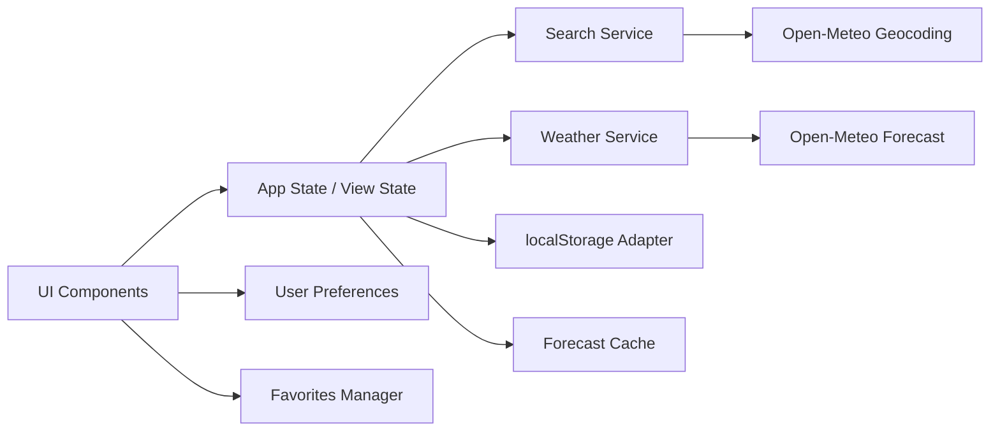

# Weather App — Plano Técnico

## Architecture Overview

O projeto será uma aplicação web em React + TypeScript com arquitetura orientada a componentes e serviços dedicados. A camada de apresentação será responsável apenas por renderização, eventos de interação e consumo de estado; a lógica de integração com Open-Meteo ficará isolada em serviços; e o estado da aplicação ficará centralizado em um modelo simples de máquina de estados para garantir consistência entre busca, clima, erro e favoritos.

Diagrama conceitual:



### Camadas principais
- UI: componentes de busca, favoritos, previsão, unidades, estados e acessibilidade
- Domain model: tipos para Localidade, Current Weather, Daily Forecast, Preferences e Favorites
- Services: geocoding, forecast, geolocation, cache e validação de respostas
- Storage: persistência de favoritos, preferências e cache com chaves versionadas
- State orchestration: controle de fluxo de busca, seleção, carregamento, retries e telas de erro

### Decisão de arquitetura
- Usar React com composição de componentes e hooks reutilizáveis
- Isolar o modelo de domínio para evitar acoplamento entre API externa e rendering
- Tratar erro, loading e vazio como estados explícitos e observáveis para a UI
- Priorizar previsibilidade sobre abstrações complexas; o MVP exige robustez de concorrência e cache, mas sem over-engineering

---

## Tech Stack

- React + Vite para aplicação SPA
- TypeScript em modo estrito para contrato estável e validação de dados
- Tailwind CSS para visual dark glassmorphism e responsividade
- Vitest + Testing Library para testes unitários e de integração
- Playwright para E2E, incluindo acessibilidade e fluxos críticos
- Open-Meteo Geocoding API e Forecast API sem API key
- localStorage como persistência client-side
- Biome para lint e formatação

### Justificativa
- O ecossistema escolhido atende a especificação do projeto e reduz dependências externas
- O uso de Open-Meteo é compatível com o requisito de sem backend próprio
- Vitest e Playwright cobrem de forma eficiente unitários, integração e E2E
- Tailwind acelera a implementação de interface responsiva e visual consistente

---

## Project Structure

```text
src/
  components/
    SearchBar/
    SearchSuggestions/
    WeatherCard/
    ForecastList/
    FavoritesList/
    UnitToggle/
    LocationHeader/
    ErrorState/
    LoadingState/
  hooks/
    useDebouncedSearch.ts
    useGeolocation.ts
    useLocalStorage.ts
    useWeatherQuery.ts
  services/
    geocoding.ts
    forecast.ts
    geolocation.ts
    weatherCodes.ts
    storage.ts
    validation.ts
  types/
    location.ts
    weather.ts
    preferences.ts
    favorites.ts
  utils/
    date.ts
    units.ts
    normalize.ts
    cache.ts
  state/
    app-state.ts
    reducer.ts
    selectors.ts
  App.tsx
  main.tsx
  index.css

tests/
  unit/
  integration/
  e2e/

specs/
  weather-app-spec.md

plans/
  weather-app-plan.md

tasks/
  weather-app-tasks.md
```

### Responsabilidades por pasta
- components: apresentação pura e acessível
- hooks: lógica reutilizável de busca, geolocalização e persistência
- services: contratos de API e validação externa
- types: modelo de domínio do aplicativo
- utils: normalização, conversões e manipulação de datas
- state: máquina de estados e seleção de dados

---

## Data Model

### Localidade
```ts
interface Location {
  id: string;
  name: string;
  latitude: number;
  longitude: number;
  country?: string;
  countryCode?: string;
  admin1?: string;
  timezone: string;
}
```

### Localidade de geolocalização
```ts
interface GeolocationLocation extends Location {
  id: `geolocation:${string}`;
  name: 'Localização atual';
}
```

### Forecast canônico
```ts
interface WeatherForecast {
  location: Location;
  current: {
    time: string;
    temperature: number;
    relativeHumidity: number | null;
    apparentTemperature: number | null;
    windSpeed: number | null;
    weatherCode: number | null;
  };
  daily: Array<{
    date: string;
    weatherCode: number | null;
    temperatureMax: number | null;
    temperatureMin: number | null;
    precipitationProbability: number | null;
  }>;
  timezone: string;
  storedAt: number;
}
```

### Preferências
```ts
interface Preferences {
  temperatureUnit: 'C' | 'F';
  speedUnit: 'km/h' | 'mph';
}
```

### Favoritos
```ts
interface FavoriteItem {
  location: Location;
}
```

### Estado observável
```ts
type AppState =
  | 'INITIAL'
  | 'SEARCHING'
  | 'RESULTS'
  | 'NO_RESULTS'
  | 'LOCATING'
  | 'WEATHER_LOADING'
  | 'WEATHER'
  | 'WEATHER_STALE'
  | 'SEARCH_ERROR'
  | 'WEATHER_ERROR';
```

### Regras de domínio
- `id` é a identidade primária para deduplicação de favoritos
- `storedAt` deve ser gerado em `Date.now()` e usado para expiração do cache
- `timezone` é obrigatório e usado para a apresentação de datas e horários
- Dados são armazenados em unidades canônicas e convertidos apenas na UI

---

## Data Flow

### 1. Busca por localidade
- O usuário digita no campo de busca
- A entrada é normalizada: trim + compressão de espaços internos
- O hook de debounce dispara após 300 ms
- A requisição de geocoding é iniciada somente quando a consulta tem pelo menos 2 letras Unicode
- O serviço aborta a operação anterior sempre que possível
- A resposta mais recente prevalece; respostas antigas são ignoradas

### 2. Seleção da localidade
- A localidade escolhida passa a ser a seleção atual
- O estado muda para `WEATHER_LOADING`
- A chamada de forecast é iniciada com latitude, longitude e timezone da cidade
- O cache local é consultado antes de acelerar a renderização ou emitir erro

### 3. Resposta do forecast
- O serviço valida a estrutura da resposta, timezone, unidades e campos obrigatórios
- Se a resposta for válida, ela é convertida para o modelo de domínio
- Se houver falhas parciais, os campos inválidos são marcados como indisponíveis
- O resultado é salvo em cache local e renderizado no estado correspondente

### 4. Geolocalização automática
- Ao abrir a aplicação, inicia uma tentativa única com timeout de 10s
- Em sucesso, cria uma Localidade sintética com `id` calculado a partir de coordenadas arredondadas em 4 casas decimais
- Em falha, a aplicação retorna ao estado inicial e mantém o fluxo manual disponível
- A geolocalização não sobrescreve seleção do usuário quando ela chega depois

### 5. Favoritos e persistência
- O usuário salva a localidade atual como favorito
- O item é persistido em `localStorage` usando a chave correta
- Em abertura, favoritos e preferências são restaurados e validados
- O cache de forecast é consultado por `location.id` e revalidado quando necessário

---

## External APIs

### Geocoding API
- Endpoint: `GET https://geocoding-api.open-meteo.com/v1/search`
- Parâmetros relevantes: `name`, `count=10`, `language=pt`
- Critérios de aceite: aceita busca por cidade, region, acentos e espaços; ordena resultados by provider output; suporta até 10 sugestões
- Validação: rejeitar entradas vazias, consultas com menos de 2 letras Unicode e estruturas inválidas

### Forecast API
- Endpoint: `GET https://api.open-meteo.com/v1/forecast`
- Parâmetros relevantes: latitude, longitude, `timezone=auto`, `forecast_days=7`, `current`, `daily`
- Regras de negócio: uso de unidades canônicas em Celsius e km/h; conversão somente em UI
- Validação: campos estruturais obrigatórios, timezone consistente com a localidade e unidades compatíveis

### Geolocation API
- Interface do navegador: `navigator.geolocation`
- Regras: tentativa única no init, timeout de 10s, feedback não bloqueante e prioridade do usuário sobre a operação automática

### Limitations e invariantes
- Não há backend próprio nem servidor de dados
- Toda resposta externa deve ser validada antes de compor o modelo de domínio
- Todas as chamadas devem ser protegidas por timeout, retry controlado e concorrência explícita

---

## State Management

A abordagem será um estado local de aplicação centralizado, sem necessidade de biblioteca adicional como Redux, dado o escopo e a complexidade do MVP. A estrutura sugerida:

- `App` consulta um reducer para transições de tela e dados principais
- `useWeatherQuery` encapsula o ciclo de request, retry, timeout e atualização de cache
- `useDebouncedSearch` centraliza a busca com debounce e cancelamento
- `useLocalStorage` abstrai persistência com degradação graciosa
- `useGeolocation` encapsula a tentativa automática e priorização de ação do usuário

### Estrutura de estado
```ts
interface AppViewState {
  appState: AppState;
  selectedLocation: Location | null;
  searchQuery: string;
  suggestions: Location[];
  currentForecast: WeatherForecast | null;
  lastError: string | null;
  favorites: Location[];
  preferences: Preferences;
}
```

### Vantagens
- reduz acoplamento entre render e lógica de negócio
- facilita testes específicos de cada transição
- torna a prioridade de ações do usuário explícita
- mantém estado observável para `aria-live` e acessibilidade

---

## Error Handling Strategy

### Estados de UI
- `INITIAL`: sem busca ativa ou localidade selecionada
- `SEARCHING`: busca de geocoding em andamento
- `RESULTS`: sugestões disponíveis
- `NO_RESULTS`: ausência de matches
- `LOCATING`: geolocalização inicial em andamento
- `WEATHER_LOADING`: forecast em carregamento
- `WEATHER`: dados válidos e atuais
- `WEATHER_STALE`: dados anteriores preservados após falha
- `SEARCH_ERROR` e `WEATHER_ERROR`: erros que interrompem ou exigem retry

### Regras de retry e timeout
- Geocoding e forecast: deadline total de 5s
- Geolocalização: deadline de 10s
- Retry automático apenas para falhas transitórias e 5xx
- Política de backoff: 250 ms, 500 ms, 1000 ms
- 4xx, inclusive 429, não recebem retry automático
- 429 global: bloqueia novas tentativas de geocoding/forecast por 60s
- Respostas tardias após deadline são ignoradas

### Estratégia de resiliência
- Dados anteriores permanecem visíveis em caso de falha de forecast
- Campo ausente ou invalidado no payload vira `Indisponível`
- cache expirado é descartado antes do uso
- `localStorage` quebrado ou cheio não bloqueia a UI; apenas a persistência é desativada

---

## Testing Strategy

### Unitários (Vitest)
Cobrir:
- normalização de busca (trim, espaços duplicados, caracteres Unicode)
- validação de geocoding e forecast
- conversão de unidades (`C` -> `F`, `km/h` -> `mph`)
- mapeamento de `weather_code`
- timezone e data em fuso da localidade
- deduplicação de favoritos por `location.id`
- revalidação e expiração de cache

### Integração
Cobrir:
- fluxo busca -> seleção -> forecast
- geolocalização em caminho de sucesso e fallback
- resposta parcial da API
- concorrência e cancelamento de requests
- persistência correta de favoritos e preferências
- tratamento de `WEATHER_STALE` e `WEATHER_ERROR`

### E2E (Playwright)
Cobrir:
- busca por cidade, seleção e dados exibidos
- atualização manual de dados
- alternância de unidades
- adicionar/remover favoritos
- abrir favorito com cache e refresh
- fluxo sem geolocalização
- erro de forecast com fallback de dados antigos
- acessibilidade básica via teclado e leitura de live region

### Critério de qualidade
- Todo requisito crítico da spec deve ter uma correspondência direta em testes
- Cenários de edge case devem ter testes de regressão
- TDD será usado para regras complexas de validação, cache e concorrência

---

## Risks & Trade-offs

### Risco 1: concorrência de buscas
- Se múltiplas buscas responderem fora de ordem, a UI pode mostrar dados incorretos.
- Mitigação: abortar requests e ignorar respostas fora de ordem com a última query válida.

### Risco 2: respostas parciais da API
- A Open-Meteo pode responder com campos omitidos ou timezone inconsistente.
- Mitigação: validação estrita por contrato e degradação elegante para `Indisponível`.

### Risco 3: geolocalização inconsistente por navegador
- Algumas combinações de navegador/ambiente impedem acesso à geolocalização.
- Mitigação: timeout de 10s, fallback sem bloquear interface e precedência do usuário.

### Risco 4: persistência local limitada
- `localStorage` pode falhar ou estar cheio.
- Mitigação: capturar erro e continuar funcionando sem persistência, com aviso não bloqueante.

### Trade-offs do MVP
- Não haverá backend próprio, histórico de clima nem mapas interativos
- A aplicação prioriza confiabilidade, responsividade e acessibilidade sobre recursos avançados
- A simplificação do gerenciamento de estado em reducer local reduz complexidade sem perder corretude de negócio

---

## Rastreabilidade para a spec

- FR-01 e AC-01: busca, normalização, debounce e concorrência
- FR-02 e AC-02: geolocalização e precedência da ação do usuário
- FR-03 e FR-04 e AC-03: previsão atual e 7 dias, timezone e dados parciais
- FR-05 e AC-04: unidades, atualização manual e persistência de preferências
- FR-06 e AC-05: favoritos, cache e localStorage
- FR-07 e FR-08 e AC-06: estados, erros, retry, keyboard e acessibilidade
- FR-09 e AC-07: privacidade, validação e uso seguro de coordenadas e texto externo

Este plano define a arquitetura, contratos de domínio, fluxo de dados e estratégia de testes para sustentar a implementação do Weather App com aderência à spec e ao fluxo SDD.
